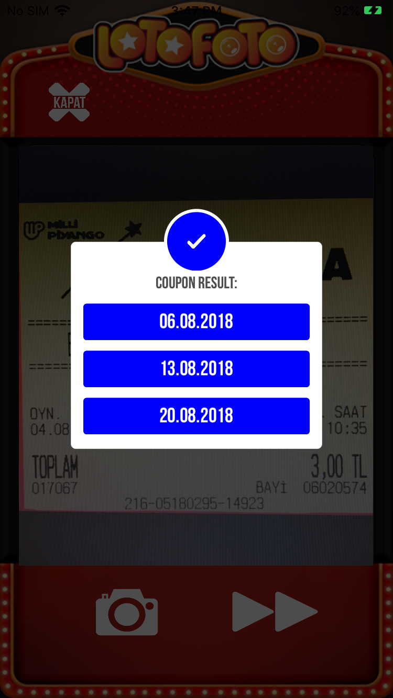

### Introduction
 
- This is the source code of turkey lottery scan and checking app with swift 5.
  
### Screenshots
      

 
 ### Main Feature.
 The user can scan the lottery coupon by the real camera and check the lottery result automatically.
 The main technology is the Optical Character Recognition(OCR) with OpenCV.
 To support high accuracy of OCR, it is necessary to process the camera image with opencv.
 This project use the CVWrapper to use opencv c++ code by bridging header.
 
 

